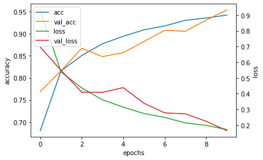
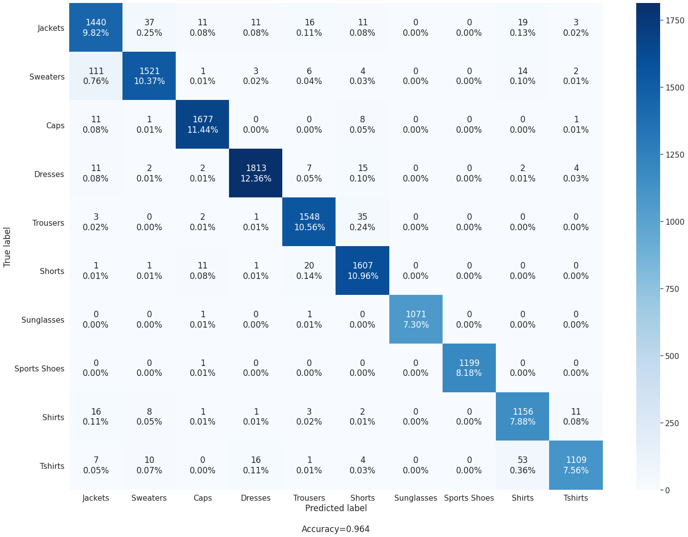
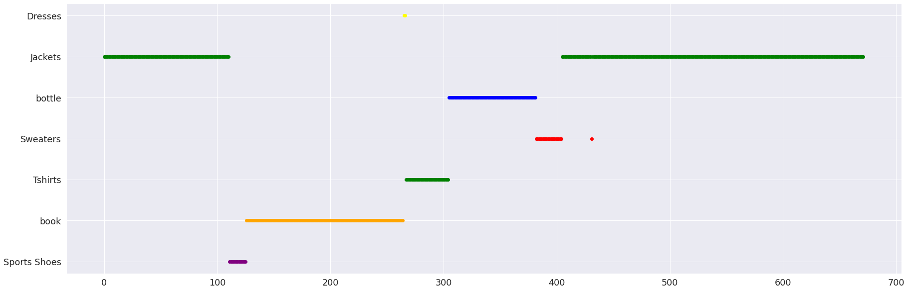

This part contains the implementation of the Stand-alone self attention model in tensorflow.        
This is divided into parts as:-         
**readme**           
**attention** containg the module of attention stem and attention(used in convolutions core blocks)           
**config** containg the arguments we will pass in the command line           
**main** containg the execution of all the functions      
**model** containg the architecture of the model         
**preprocess** containg the arguments that will preprocess the images

**REFERENCES: -**       
[ResNet](https://github.com/suvoooo/Learn-TensorFlow/blob/master/resnet/Implement_Resnet_TensorFlow.ipynb)          
[Stand-alone_Pytorch_Implementation](https://github.com/leaderj1001/Stand-Alone-Self-Attention)

The categories which were cxonsidered fginally were as follows:- 
**'Jackets','Sweaters', 'Caps','Dresses','Trousers','Shorts', 'Sunglasses', 'Sports Shoes', 'Shirts','Tshirts'**

The accuracy achieved by the model was 
**Validation accuracy = 0.9543129801750183**
**Accuracy = 0.9425503015518188**

The training graph look like:-

The log file of trianing has been attached in the same folder. The confusion matrix of the model looks like:-   

The evaluation of the model on the real video look like:- 
