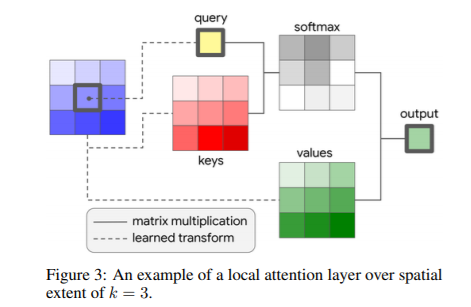
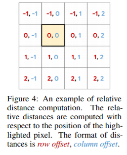
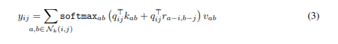

# **Implementation of Stand-Alone Self-Attention Research Paper**    
## **Introduction**   
This part contains the implementation of the [Stand-alone self attention research paper](https://arxiv.org/pdf/1906.05909.pdf) in tensorflow.        
This is divided into parts as:-         
**readme**           
**attention** containg the module of attention stem and attention(used in convolutions core blocks)           
**config** containg the arguments we will pass in the command line           
**main** containg the execution of all the functions      
**model** containg the architecture of the model         
**preprocess** containg the arguments that will preprocess the images

## **Methods**
The paper focuses on the attention in images and also of two types: -

### **Attention Stem**
The layer is added in the initial part of the architecture so as to extract basic features of the image, in which convolution was outperforming the Attention layer proposed. The performs equal to convolution. The equation is some what looks like: -

### **Attention**
The latter layers which removed the spatial convolution is the attention layer. It also performs equal to the spatial convolution layer but significantly  reduces the number of FLOPS and parameters. It performs the atteniton procedure, as given in the figure below.     

The equations used is: -
  

## **References**       
[ResNet](https://github.com/suvoooo/Learn-TensorFlow/blob/master/resnet/Implement_Resnet_TensorFlow.ipynb)          
[Stand-alone_Pytorch_Implementation](https://github.com/leaderj1001/Stand-Alone-Self-Attention)

